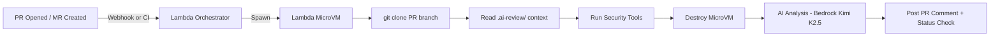

# AI PR Reviewer

Automated AI-powered code review for every pull request / merge request. Scans for security vulnerabilities, code quality issues, IaC misconfigs, and OWASP Top 10 violations — posts findings directly as PR comments.

**Repo:** [github.com/aquavis12/AI-PR-Reviewer](https://github.com/aquavis12/AI-PR-Reviewer)

[](https://github.com) [](https://gitlab.com) [](https://kiro.dev) [](https://aws.amazon.com/bedrock/) [](LICENSE)

---

## How It Works



**Key:** Each scan runs in an isolated **Lambda MicroVM** (Firecracker). The MicroVM clones the repo, reads your `.ai-review/` context files, runs tools, and is **destroyed immediately** — zero residual state.

> **Why Lambda MicroVMs?** See [below](#why-lambda-microvms-for-pr-review).

---

## Integration Options

| Mode | How it runs | Best for |
|------|-------------|----------|
| **GitHub Actions** | Drop `.github/workflows/ai-review.yml` into your repo | Public repos, easy setup |
| **GitLab CI** | Drop `.gitlab-ci-review.yml` into your repo | GitLab projects |
| **Kiro Headless** | Kiro agent reviews PRs autonomously | Deep multi-file analysis |
| **Webhook** | Point GitHub/GitLab webhook at Lambda URL | Orgs, central control |

---

## Quick Start

### GitHub Actions (2 minutes)

1. Copy `.github/workflows/ai-review.yml` into your repo
2. Set secret: `AI_REVIEWER_API_URL` = your Lambda Function URL
3. Done — every PR gets an AI security review

### GitLab CI (2 minutes)

1. Copy `.gitlab-ci-review.yml` into your repo root
2. Set CI/CD variable: `AI_REVIEWER_API_URL`
3. Done

### Kiro Headless

```bash
kiro review --repo . --pr 42 --config kiro/review-config.yaml
```

---

## Context Files (`.ai-review/`)

Context files live **in your own repo** — like `.github/` or `.eslintrc`. When the MicroVM clones your repo, it reads `.ai-review/` and feeds that context to the AI reviewer.

This tells the AI **what your project does** and **what standards to apply**.

### Setup

Create a `.ai-review/` directory in your repo:

```
your-repo/
├── .ai-review/
│   ├── context.md           # What the project does, architecture, standards
│   ├── security.md          # Security requirements (PCI-DSS, SOC2, etc.)
│   ├── cost-policy.md       # Cost thresholds for IaC changes
│   └── terraform/
│       └── standards.md     # Terraform-specific rules
├── src/
└── ...
```

### Example: `.ai-review/context.md`

```markdown
# Project Context

## What This Does
Payment processing microservice — handles Stripe/PayPal transactions.

## Code Standards
- All functions must have type hints and docstrings
- No bare except blocks
- Database queries use SQLAlchemy ORM only
- Structured logging with structlog

## Security (PCI-DSS)
- NEVER log full card numbers
- All PII encrypted at rest (AES-256)
- Secrets from AWS Secrets Manager only
- Dependencies pinned to exact versions
```

### How It Works

1. MicroVM clones your PR branch
2. Checks for `.ai-review/` directory
3. Loads files: `context.md` → `security.md` → category-specific → language-specific
4. Injects context into the AI prompt (Bedrock) or reference docs (Kiro)
5. AI review is now aware of YOUR project's rules

**No pre-configuration needed.** Just commit `.ai-review/` to your repo.

### Works with Both Approaches

| Approach | How context is used |
|----------|-------------------|
| **Bedrock LLM** | Injected as preamble in the AI prompt |
| **Kiro Headless** | Loaded as reference documents |

Same files, both approaches.

---

## What It Scans

| Language / Framework | Tools | Checks |
|---------------------|-------|--------|
| Python | bandit, pip-audit, ruff | CVEs, code injection, secrets, style |
| JavaScript | npm audit, eslint-security | Prototype pollution, ReDoS, supply chain |
| Java | OWASP dep-check, SpotBugs | Deserialization, Log4Shell, transitive deps |
| Terraform | tfsec, checkov, infracost | Misconfigs, CIS benchmarks, cost estimation |
| CloudFormation | cfn-lint, cfn-nag, checkov | Invalid props, security groups, hardcoded secrets |
| Any | gitleaks, trufflehog | Secrets, API keys, tokens |

> Terraform/CloudFormation/cost scanning tracked in `feature/infra-scanning` branch. See [ADR-001](docs/adr/001-infra-scanning.md).

---

## Lambda MicroVM Flow

When triggered, the orchestrator:

```
1. Spawn MicroVM (Firecracker isolation)
2. Clone PR branch into VM
3. Read .ai-review/ context from the clone
4. Detect languages → select relevant tools
5. Run security scans (bandit, tfsec, npm audit, etc.)
6. Destroy MicroVM (zero residual state)
7. Send results to Bedrock Kimi K2.5 with context
8. Post structured review comment on PR
9. Set commit status check (pass/fail)
```

Untrusted PR code never touches the orchestrator environment.

---

## Why Lambda MicroVMs for PR Review

Traditional CI-based code review tools run in shared environments — the same runner that lints your code also processes the next PR. This is dangerous when you're reviewing **untrusted code from external contributors.**

### The Problem

When a PR arrives, the reviewer needs to:
- `git clone` the PR branch (could contain malicious hooks)
- `pip install` / `npm install` dependencies (could execute arbitrary code via `setup.py`, `postinstall`)
- Run security tools that parse untrusted code (parsers can be exploited)
- Read `package.json`, `requirements.txt`, `pom.xml` (supply chain attack vectors)

In a shared environment, a malicious PR can:
- Steal secrets from ENV vars
- Infect the runner for future jobs
- Exfiltrate source code from other repos
- Mine crypto on your compute

### The Solution: Firecracker Isolation

Lambda MicroVMs run each scan in a **dedicated Firecracker VM**:

| Without MicroVMs | With MicroVMs |
|------------------|---------------|
| Malicious `setup.py` escapes to host | Contained in disposable VM |
| `postinstall` scripts access shared secrets | No secrets in VM — only scan tools |
| Infected runner affects next job | VM destroyed after scan — nothing persists |
| Cross-contamination between PRs | Each PR = fresh VM, isolated network |
| Reviewer needs to trust the code it reviews | Reviewer doesn't care — VM is expendable |

### Why Not Just Docker / Lambda / ECS?

| Option | Isolation Level | Problem |
|--------|----------------|---------|
| Lambda (standard) | Process-level | Can't `git clone`, install packages, run multi-step tools |
| Docker (ECS/Fargate) | Container-level | Shared kernel, container escapes possible, slower cold start |
| EC2 instance | Full VM | Expensive, slow to provision per-PR, wasteful |
| **Lambda MicroVM** | **Firecracker VM** | **Full isolation, millisecond boot, auto-destroy, pay-per-ms** |

Lambda MicroVMs give you:
- **Full filesystem** — clone repos, install packages, run any binary
- **Firecracker boundary** — hardware-level isolation, not just namespaces
- **Millisecond boot** — no cold-start penalty like EC2
- **Auto-destroy** — terminated after use, no cleanup needed
- **Internet egress** — can fetch packages from registries during scan
- **Pay-per-ms** — only charged while the scan runs (~5-30 seconds)

This makes Lambda MicroVMs the **ideal execution environment** for reviewing untrusted code — you get VM-level isolation with serverless economics.

### How Is This Different From GitHub/GitLab Runners?

GitHub Actions and GitLab CI runners are designed for **building and testing your own code** — not for safely executing **untrusted external code**. Here's the key difference:

| | GitHub/GitLab Runners | AI PR Reviewer (MicroVM) |
|-|----------------------|--------------------------|
| **Trust model** | Trusts the code it runs (your repo) | Treats ALL code as hostile |
| **Secrets exposure** | Runner has access to repo secrets, OIDC tokens | MicroVM has ZERO secrets — only scan tools |
| **Persistence** | Runner reuses workspace, caches between jobs | VM destroyed after every single scan |
| **Blast radius** | Compromised runner can access other workflows, secrets, artifacts | Compromised VM = nothing — it's already dead |
| **External PRs** | Fork PRs can access secrets (if misconfigured) | External code never touches your infra |
| **Multi-step execution** | Limited by job timeout, step isolation is process-level | Full VM with filesystem, network, any binary |
| **What runs the tools** | Your runner (shared with CI/CD) | Dedicated disposable VM (separate from your CI) |

**The core difference:**

- **Runners** = "I trust this code, let me build/test it"
- **MicroVM** = "I don't trust this code, let me scan it in a cage and throw the cage away"

### When Runners Are Fine vs When You Need MicroVMs

| Scenario | Runner OK? | MicroVM Needed? |
|----------|-----------|-----------------|
| Reviewing PRs from your own team | Yes | Optional |
| Reviewing PRs from external contributors | Risky | **Yes** |
| Open source repo (anyone can PR) | Dangerous | **Yes** |
| Scanning packages before adoption | No | **Yes** |
| Running `pip install` on untrusted package | No | **Yes** |
| Static analysis on diff only (no install) | Yes | Optional |
| Org with compliance requirements (SOC2, PCI) | Depends | **Yes** (audit trail + isolation) |

**TL;DR:** If you only review PRs from trusted teammates, runners work fine. The moment you accept PRs from forks, external contributors, or scan untrusted packages — you need the isolation that MicroVMs provide. Runners weren't designed to be sacrificial.

---

## Project Structure

```
AI-PR-Reviewer/
├── src/
│   ├── reviewer.py              # Core review engine (orchestrates pipeline)
│   ├── diff_analyzer.py         # PR diff parsing, IaC detection, risk patterns
│   ├── ai_client.py             # AI abstraction (Bedrock / OpenAI)
│   ├── config.py                # YAML + env var config loader
│   ├── context_manager.py       # Reads .ai-review/ from cloned repo
│   └── iac_scanner.py           # tfsec, checkov, cfn-lint, infracost
├── providers/
│   ├── base.py                  # Abstract provider interface (PRInfo, ReviewComment)
│   ├── github.py                # GitHub API (PRs, comments, status, webhooks)
│   └── gitlab.py                # GitLab API (MRs, notes, status, webhooks)
├── kiro/
│   ├── review-config.yaml       # Kiro headless agent config
│   ├── review-spec.md           # Agent behavior spec + IaC rules
│   └── hooks.py                 # pre/on/post review lifecycle
├── examples/
│   └── .ai-review/              # Example context files to copy into your repo
│       ├── context.md
│       └── cost-policy.md
├── .github/workflows/
│   ├── ai-review.yml            # Drop-in workflow (copy to any repo)
│   └── deploy.yml               # CI/CD for this project (Lambda deploy)
├── .gitlab-ci-review.yml        # Drop-in GitLab CI config
├── docs/adr/
│   └── 001-infra-scanning.md    # ADR: Terraform + CFN + cost estimation
├── lambda_handler.py            # AWS Lambda entry point (webhook receiver)
├── Dockerfile                   # Self-hosted container option
├── config.example.yaml          # Configuration template
├── requirements.txt
├── .gitignore
└── LICENSE (MIT)
```

---

## Configuration

```yaml
# config.yaml
provider: github  # github | gitlab

ai:
  provider: bedrock
  model: moonshotai.kimi-k2.5
  temperature: 0.2
  max_tokens: 4000

review:
  post_comment: true
  set_status: true
  fail_on: critical        # critical | high | medium | never
  ignore_paths:
    - "*.md"
    - "docs/*"
    - "*.lock"

kiro:
  enabled: false
  spec: kiro/review-spec.md
  depth: standard          # quick | standard | deep
```

---

## Environment Variables

| Variable | Required | Description |
|----------|----------|-------------|
| `GITHUB_TOKEN_SECRET_ARN` | For GitHub | Secrets Manager ARN for GitHub PAT |
| `GITLAB_TOKEN_SECRET_ARN` | For GitLab | Secrets Manager ARN for GitLab token |
| `AWS_REGION` | No | Default: `us-east-1` |
| `RESULTS_BUCKET` | No | S3 bucket for scan reports |
| `FAIL_ON` | No | Override fail threshold |
| `KIRO_ENABLED` | No | Enable Kiro headless (`true`/`false`) |
| `INFRACOST_API_KEY` | For cost | Infracost API key |

---

## Deploy

```bash
# Build layer
pip install requests boto3 pyyaml -t python/lib/python3.11/site-packages
zip -r layer.zip python/

# Deploy
aws lambda publish-layer-version --layer-name ai-pr-reviewer-deps \
  --zip-file fileb://layer.zip --compatible-runtimes python3.11

zip -r lambda.zip lambda_handler.py src/ providers/
aws lambda update-function-code --function-name ai-pr-reviewer \
  --zip-file fileb://lambda.zip
```

Or push to `main` — GitHub Actions handles it via OIDC.

---

## Cost

- ~$0.003 per review (Bedrock Kimi K2.5)
- Lambda: ~$0.001 per invocation
- Total: **< $0.01 per PR review**

---

## Author

Built by [Vishnu](https://github.com/aquavis12) — AWS Community Builder (Security) | 14x AWS Certified

## License

MIT
